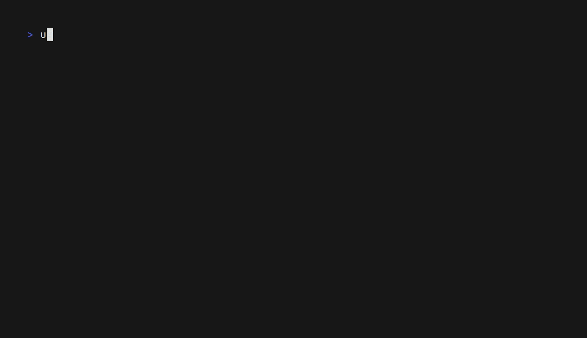
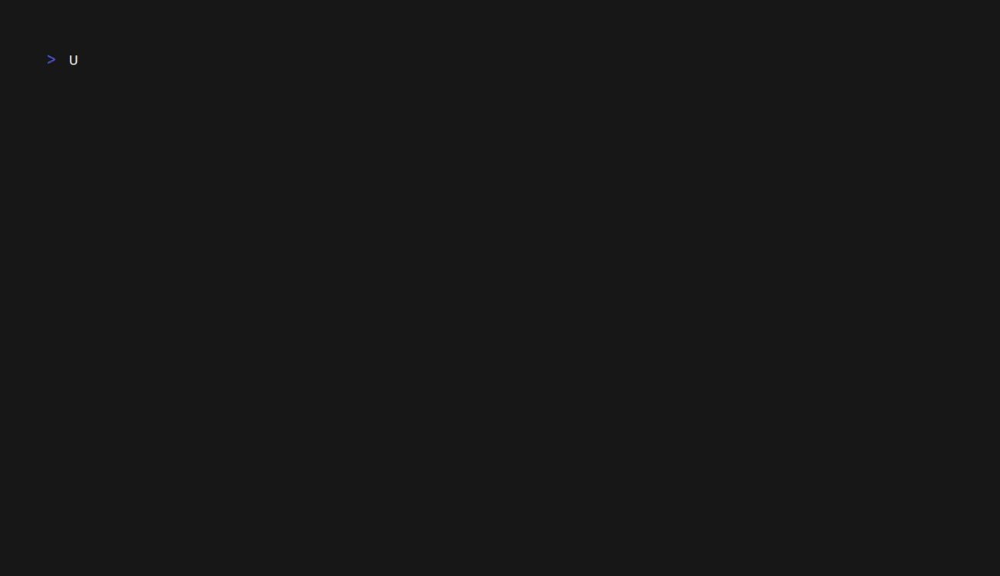

<div align="center">


> _Unofficial typst package manager_

**UTPM** is a _package manager_ for **[local](https://github.com/typst/packages#local-packages)** and **remote** packages. Create quickly new _projects_ and _templates_ from a **singular tool**, and then **publish** it _directly_ to **Typst**!

</div>

## 🔥 Features

- [x] ✨ Create packages automatically (`utpm create`)
  - [x] ⏯️ Interactive
  - [x] ⌨️ Cli version
- [x] 🛠 Put your package directly into your local packages (`utpm link`)
  - 💻 Link without copying! (`utpm link --no-copy`)
- [x] 🌐 Dependencies outsite typst!
  - [x] 📦 Install directly from the tool
  - [x] 🔒 Portable installer (limited for now)
- [x] 📃 List all your packages
  - [x] 🗃️ In a form of a list `utpm list`
  - [x] 🌲 In a form of a tree `utpm tree`
- [x] 💥 Customize your output (json or classic, `-j` in yours commands)
- [x] 🗄️ Delete and bulk delete your packages (`utpm unlink`, `utpm bulk-delete`)
- [ ] 🚀 Publish it directly to Typst!

**_And others!_**

## 🔎 How to use it?

### The basic workflow

- _Firstly you'll need to [create](#create) your `typst.toml` file!_
- _Then, edit your file! Like `index.typ` or `lib.typ`_
- _Finally, [link](#link) your new package to typst!_

### Commands

#### 🗄️ Bulk Delete

<!-- TODO: GIF -->

_A command to delete multiple packages at once!_


<div id="create">

#### ✨ Create
_Create a `typst.toml` to make a package_


<!-- TODO: GIF v2 -->

</div>
<div id="help">


#### ❓ Help

_Generate a help message_


</div>
<div id="install">

#### 📦 Install

<!-- TODO: GIF & text-->

</div>
<div id="link">

#### 🛠 Link

<!-- TODO: GIF & text-->

</div>
<div id="list">

#### 🗃️ List
<!-- TODO: text -->


</div>
<div id="package-path">
<!-- TODO: text -->

#### 🚦 Package Path


</div>
<div id="tree">

#### 🌲 Tree

_A simple command to show all your packages install in your local dir like a tree!_


</div>
<div id="unlink">
<!-- TODO: GIF -->

#### 🗄️ Unlink


</div>

## ⚡ Install

You will need Cargo and Rust.

Simpliest way :

```bash
cargo install --git https://github.com/Thumuss/utpm
```

## Contribution

If you want to help me dev this package, simply make an issue or a PR

By using this app, you contribute to it, thank you! <3
