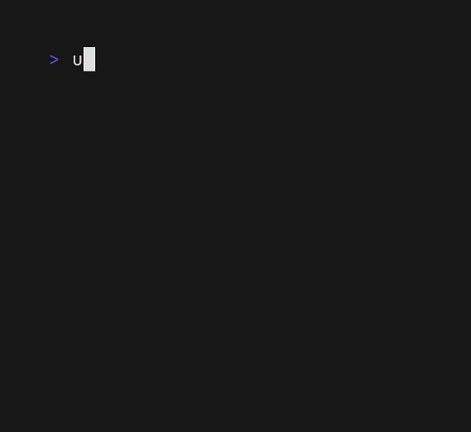

<div align="center">


> _Unofficial typst package manager_

**UTPM** is a _package manager_ for **[local](https://github.com/typst/packages#local-packages)** and **remote** packages. Create quickly new _projects_ and _templates_ from a **singular tool**, and then **publish** it _directly_ to **Typst**!

</div>

## 🔥 Features

- [x] ✨ Create packages automatically (`utpm create`)
    - [x] ⏯️ Interactive
    - [x] ⌨️ Cli version
- [x] 🛠 Put your package directly into your local packages (`utpm link`)
    - 💻 Link without copying! (`utpm link --no-copy`)
- [x] 🌐 Dependencies outsite typst!
    - [x] 📦 Install directly from the tool 
    - [x] 🔒 Portable installer (limited for now)
- [x] 📃 List all your packages
    - [ ] 🗃️ In a form of a list `utpm list`
    - [x] 🌲 In a form of a tree `utpm tree`
- [x] 💥 Customize your output (json or classic, `-j` in yours commands) 
- [x] 🗄️ Delete and bulk delete your packages (`utpm unlink`, `utpm bulk-delete`)
- [ ] 🚀 Publish it directly to Typst!

***And others!***

## 🔎 How to use it?

### The basic workflow


+ *Firstly you'll need to [create](#create) your `typst.toml` file!*
+ *Then, edit your file! Like `index.typ` or `lib.typ`*
+ *Finally, [link](#link) your new package to typst!*

### Commands


#### 🗄️ Bulk Delete

*A command to delete multiple packages at once!*


<div id="create"> 

#### ✨ Create

</div>

#### ❓ Help

#### 📦 Install

<div id="link"> 

#### 🛠 Link

</div>

#### 🗃️ List


#### 🚦 Package Path


#### 🌲 Tree

*A simple command to show all your packages install in your local dir like a tree!*



#### 🗄️ Unlink


## ⚡ Install

You will need Cargo and Rust.

Simpliest way :

```bash
cargo install --git https://github.com/Thumuss/utpm
```

## Contribution

If you want to help me dev this package, simply make an issue or a PR

By using this app, you contribute to it, thank you! <3
