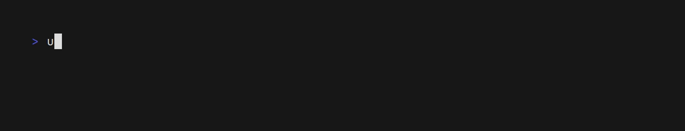
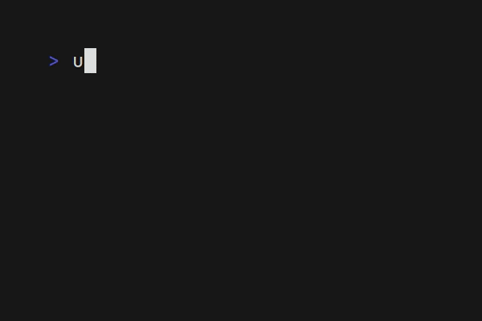

<div align="center">


> _Unofficial typst package manager_

**UTPM** is a _package manager_ for **[local](https://github.com/typst/packages#local-packages)** and **[remote](https://github.com/typst/packages)** typst packages. Quickly create and manage _projects_ and _templates_ on your system, and publish them directly to **Typst Universe** via one unified tool.  

[](https://github.com/Thumuss/utpm "Go to GitHub repo")
[](https://github.com/Thumuss/utpm)
[](https://github.com/Thumuss/utpm)
<br/>
[](https://github.com/Thumuss/utpm/releases/)
[](#license)
[](https://github.com/Thumuss/utpm/issues)


</div>

## 🔥 Features

- [x] ✨Create packages rapidly (`utpm workspace create`)
  - [x] ⏯️ Alias shorthand e.g. (`workspace = ws`)
  - [x] ⌨️ Intuitive Clap CLI
- [x] 🛠 Manage existing packages (`utpm ws link --no-copy`)
  - [x] 🔗Quick linking of remote and local packages (`utpm workspace link`)
  - [x] 🗄️ Delete and bulk delete your packages (`utpm pkg unlink`, `utpm pkg bulk-delete`)
- [x] 🌐 Dependencies outside of Typst!
  - [x] 📦 Support for third party application and plugins
  - [x] 🔒 Portable installer (limited for now)
- [x] 📃 Visualization 
  - [x] 🗃️ list `utpm pkg list`
  - [x] 🌲 tree `utpm pkg tree`

- [ ] 🚀 Automated publication directly to Typst Universe!

**_And more soon!_**

## 🔎 How to use it?

### The basic workflow

- _Firstly, you'll need to [create](#create) your `typst.toml` file!_
- _Then, edit your file! Like `index.typ` or `lib.typ`_
- _Finally, [link](#link) your new package to typst!_

### Commands

#### 🗄️ Bulk Delete

<!-- TODO: GIF -->

_A command to delete multiple packages at once!_


<div id="create">

#### ✨ Create
_Create a `typst.toml` to make a package_


<!-- TODO: GIF v2 -->

</div>
<div id="help">


#### ❓ Help

_Generate a help message_


</div>
<div id="install">

#### 📦 Install

<!-- TODO: GIF & text-->

</div>
<div id="link">

#### 🛠 Link

<!-- TODO: GIF & text-->

</div>
<div id="list">

#### 🗃️ List
<!-- TODO: text -->



</div>
<div id="package-path">
<!-- TODO: text -->

#### 🚦 Package Path


</div>
<div id="tree">

#### 🌲 Tree

_A simple command to show all packages installed in your local dir like a tree!_


</div>
<div id="unlink">
<!-- TODO: GIF -->

#### 🗄️ Unlink


</div>

## ⚡ Install

You will need Cargo and Rust.

The easiest way to install utpm using Cargo is:

```bash
$ cargo install --git https://github.com/Thumuss/utpm
```

## ❤️ Contribution

If you want to help me develop this package, simply make an issue or a PR!

By using this app, you contribute to it, thank you! <3
